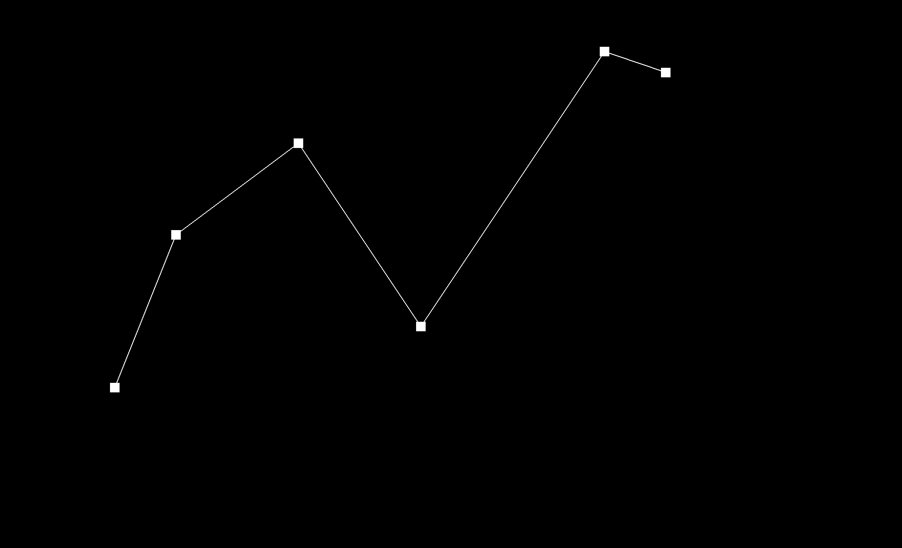
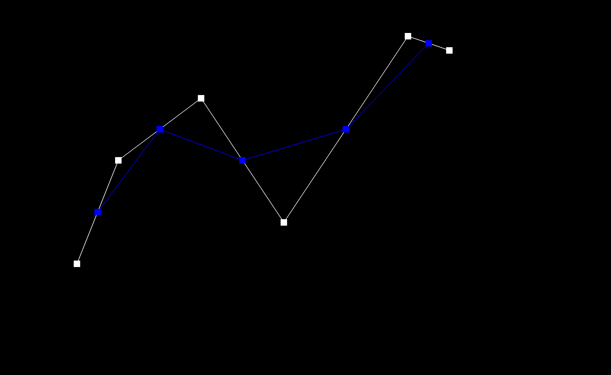
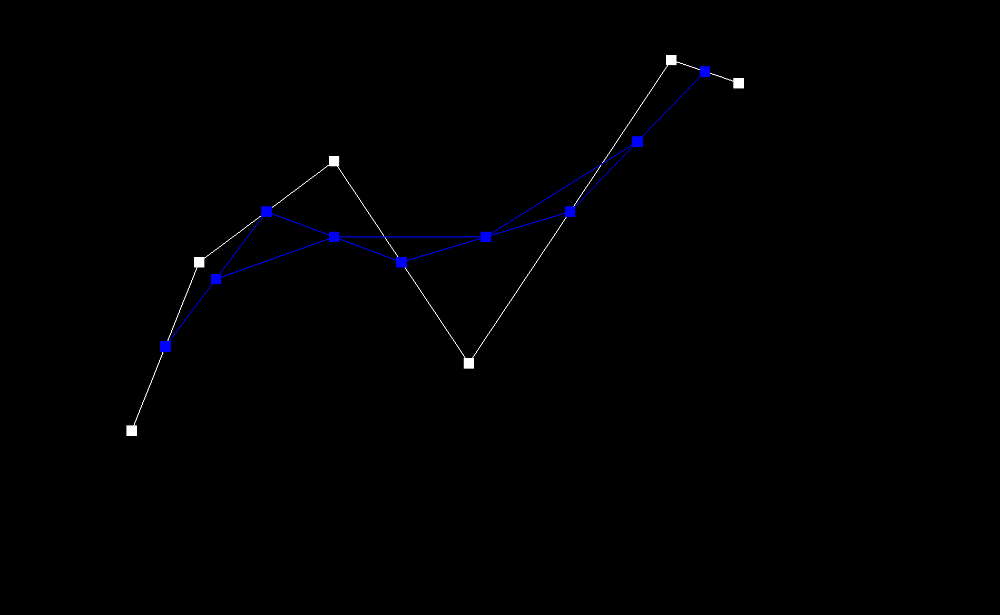
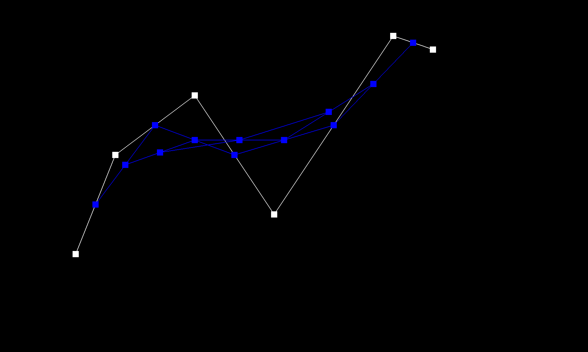
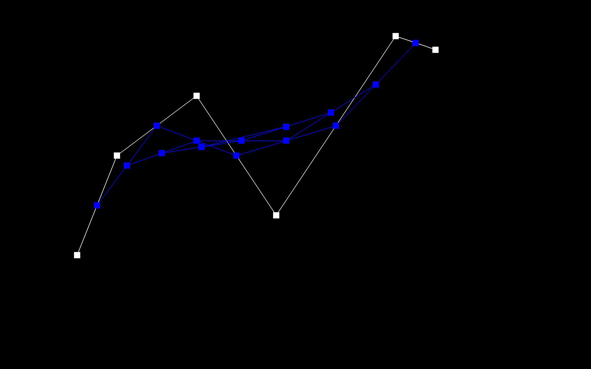
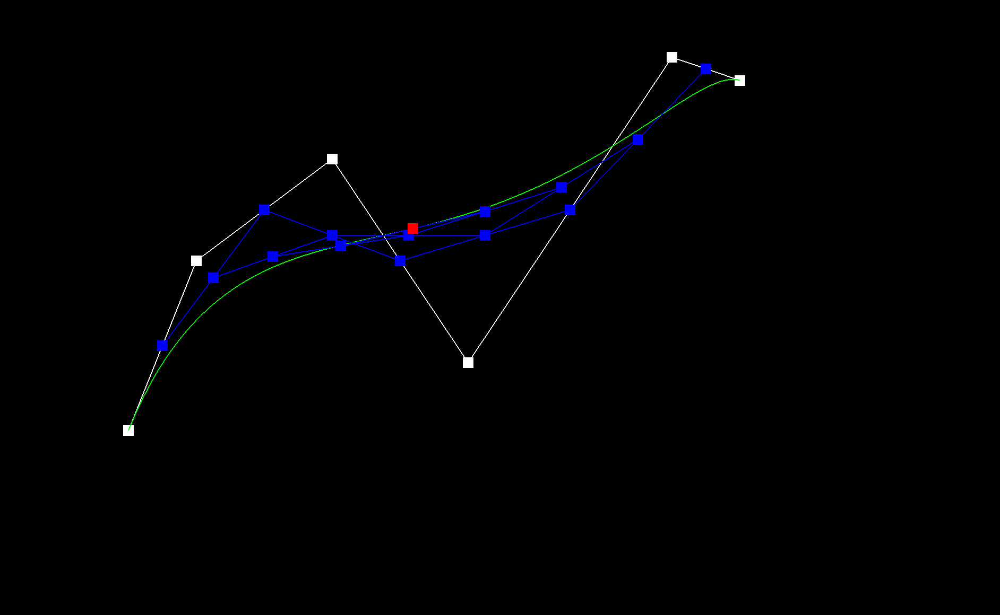
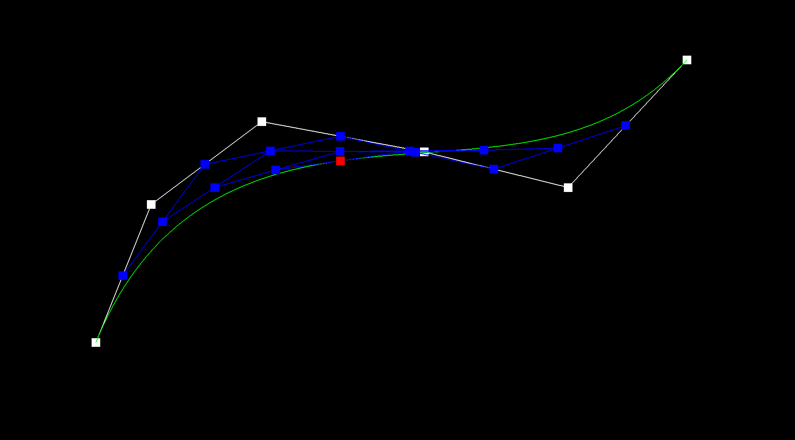

# Project 2 Write-Up

The public facing webpage for this write-up can be found at https://somaniarushi.github.io/184-p2-demo/

## Part 1

### Description and Implementation of our Algorithm
The idea of the de Casteljau's algorithm is to lerp together an arbitrary `n` points pair-wise (with a predetermined weight `t`) to generate a subsequent `n-1` points. This is done recursively until we only have `1` point and the process is then terminated. In this task, we implement one step of this process.

### Making a Curve

### Manipulating the Curve

## Part 2

### Description and Implementation of our Algorithm
The de Casteljau algorithm on a Bezier curve is to reduce `n` control points to a singular control point. The method we used to apply this algorithm to a surface is to apply this algorithm recursively to the given `nxn` points. First, we applied the algorithm to each row (each row being `n` elements) parameterized by `u`. Then we created a vector made out of these evaluated points. Then we applied our 1D evaluation algorithm on these points, parameterized by `v`. This would give you a singular point in 3D space, as desired.

### Screenshot

## Part 3

### Description and Implementation
First, we define "neighboring triangles" as all triangles that have `this` vertex as one of their vertices. We set up a half-edge traversal algorithm with this in mind, which stops implementation when we return to our original half-edge. For every half-edge, we get the associated face. For every face, we get the value of it's normal (through the Face::normal() function) and weigh it by calculating the area of the face. The area of the face is calculated by taking half the Euclidean norm of the normal. We add all these values together. Once this is complete, we normalize the resultant vector and return it.

### Comparing Teapots with Flat Shading and Phong Shading

## Part 4

### Description of Implementation
For edge flipping, we hunkered down and just drew out triangles with every single possible element labeled, using the picture posted in the edge flip Piazza thread as a guide. From there, we followed the recommendations in the spec to create variables for all elements and just reassign everything, regardless of whether or not the pointers should change. The `setNeighbors` function was very very helpful for keeping things compact!

### Doing Some Flips
After one flip

After several flips

### Our Debugging Journey
We had a very eventful debugging journey! Probably not a good thing, but because it was just too hard to debug individual lines based on the renderings, we wiped everything and restarted. We still ran into some issues after many many flips that were very hard to reproduce, so we tried to rubber duck each other with a whiteboard and rewrote the function one more time, which surprisingly fixed things.

## Part 5

### Implementation
We approached edge splitting very similarly to how we approached edge flipping

### Doing Some Splits
Before

After

### Doing Splits AND Flips
Before

After

### Debugging Journey
Like the debugging for edge flipping, we mostly just redid the whole thing at once because it was too much of a headache trying to pick apart each line. We were struggling with a strange bug that created protruding spikes in task 6, which we narrowed down to our edge splitting algorithm. Luckily, one of our friends posted their drawing of the before and after elements on the edge splitting Piazza thread, so we followed that and actually found our bugs (we were accidentally creating a few too many halfedges). After completely rewriting our function based on carefully following the drawing, we were able to fix the issue!

## Part 6

### Implementation and Debugging Techniques
- For our loop subdivision algorithm, we stayed pretty close to the algorithm that was suggested by the specification. First, we calculated the new positions of the old vertices using the degree and the neighboring vertices positions. We did not do this for boundary edges — since we did not handle subdivision for boundary vertices.
- Then, we calculated the location of all the new vertices, split our mesh and assigned those vertices that new position.
- Then, we flipped any edge that connected an old and a new vertex.
- Finally, we made sure to set all our changes in stone and clean up variables like `isNew` to make sure we could re-run subdivision without any problems trickling down.

An interesting debugging technique we used was very similar to delta-debugging — we commented out different stages of our algorithm, since they ran surprisingly independent of each other. This allowed us to pin down where our bugs were much faster than trying to debug in any other fashion, since there were so many moving elements in this question.

### Sharp Corners and Edges
  - Sharp corners and edges seem to get flattened out, resulting in a bulge-like structure. This is because, when one edge becomes two edges, the resulting faces are not parallel to each other but at an angle.
  - As an experiment, we went ahead and pre-split every edge in the `cube.dae` structure before upsampling. This led to some very interesting effects

As one might observe in the comparison images above, the bulbousness of upsampling was reduced by pre-splitting all edges once, probably because pre-splitting helped inform the upsampling process. We hypothesize that, if we had pre-split our edges even more, the resulting upsampled structure would be even less bulbous.

### Asymmetry
  - Our assumption is that the shape that upsampling takes is very dependent on the initial configuration of the mesh — the more symmetrical the initial mess, the less asymmetric it becomes eventually.
  - We split and flipped edges across the faces and discovered that in doing so we could retain some symmetry when we upsampled. This is because the faces are no  longer split asymmetrically.
